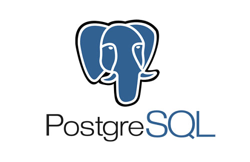

### Apresento a vocês a melhor, mais organizada e escalavel API de gestão de CPF que vocês vão ver hoje

#### Como Rodar o projeto

Tentei Deixar o mais simples possível para inicialização do projeto, então utilizei o docker e o docker-compose para rodar todo ambiente.

- Instalar pacotes: `pnpm install` | `yarn` | `npm install`
- Executar aplicação: `docker-compose up -d`
- Executar testes: `npm run test`
- A documentação das rotas pode ser acessada em: `http://localhost:3000/api/`

#### Considerações iniciais

Para esse projeto, resolvi fazer um trabalho um pouco mais elaborado, apesar de ser uma API simples quero mostrar com o código que sou capaz de fazer sistemas escalares e modulares com as melhores tecnologias que temos disponiveis hoje no ambiente do node.

Escolhi utilizar a Onion Architecture para demonstrar como podemos nos aproveitar do desacoplamento de camadas para isolarmos a lógica do negocio e assim sermos capazes de trocar componentes da nossa aplicação sem nunca fazer um esforço colossal para nos mantermos atualizados no mercado.

Toda API foi pensada para ser usada de forma que seja simples e facil trocarmos por exemplo o "Express" por um "Fastfy" apenas utilizando a inversão de dependencia, ou como pode ser simples trocarmos entre bases de dados como "postgres", "mysql", "mongodb" apenas utilizando dos principios da Clean Architecture e do SOLID

##### Aviso importante 1

As rotas `[GET] /cpf/:cpf` `[GET] /cpf/` contam com um decorator de cache, então ao realizar alguma ação, seja de deletar ou de inserir um novo elemento os resultados serao refletidos apos 60 segundos na aplicação, vocês podem conferir o decorator dentro dos use-cases e configurar a maneira de vocês para facilitar os testes da parte de vocês

##### Aviso importante 2

Quero deixar também um pequeno disclaimer sobre a pouca quantidade de testes, infelizmente dado a alta demanda que tive que atender no meu trabalho atual nos ultimos dias tive pouco tempo habil para me dedicar ao projeto, e infelizmente acabei não tendo tempo suficiente para elaborar os testes da maneira e na quantidade que eu planejei, espero que as outras funcionalidades implementadas e a estrutura possam compensar a falta de testes, e caso esse seja um ponto decisivo na avaliação peço que considerem uma conversa comigo ou enviar um desafio especifico de testes para que eu possa demonstrar minhas habilidades nesse quesito em outro momento

---

##### Arquitetura Utilizada (Onion Architecture)

---

## Onion Architecture

A **Onion Architecture** (também conhecida como Clean Architecture) é um estilo arquitetural de software que propõe uma estrutura organizada e modular, promovendo a separação de preocupações e a manutenibilidade do código. Ela foi apresentada por Jeffrey Palermo e é inspirada nos princípios do Domain-Driven Design (DDD) e na arquitetura hexagonal.

A Onion Architecture consiste em camadas concêntricas, cada uma representando um nível de responsabilidade e dependência. As camadas principais incluem:

1. **Camada de Domínio (Core/Domain):** No centro da arquitetura está a camada de domínio, que contém as entidades de negócios, regras de negócios e lógica de aplicação. É independente das outras camadas e define o núcleo da aplicação.

2. **Camada de Serviço de Aplicação (Application Services):** Esta camada contém serviços que coordenam a execução das operações de aplicação, conectando-se à camada de domínio para realizar tarefas específicas.

3. **Camada de Infraestrutura (Infrastructure):** Na borda da arquitetura, a camada de infraestrutura lida com detalhes técnicos, implementações de bibliotecas abstraidas, como acesso a banco de dados, chamadas de API externas, e configurações. Ela depende das camadas internas, mas as camadas internas não dependem dela.

### Vantagens da Onion Architecture:

- **Separação de preocupações:** As responsabilidades são claramente divididas entre as camadas, facilitando a compreensão e a manutenção do código.

- **Independência técnica:** As camadas internas (domínio e serviços de aplicação) não dependem de implementações técnicas, o que facilita a substituição ou atualização de tecnologias.

- **Testabilidade:** A arquitetura favorece a criação de testes unitários e de integração, especialmente nas camadas de domínio e serviços de aplicação.

- **Flexibilidade:** A Onion Architecture suporta a evolução da aplicação ao longo do tempo, pois as mudanças podem ser feitas em uma camada sem afetar diretamente as outras.

Essa abordagem procura criar sistemas que sejam mais adaptáveis a mudanças, fáceis de testar e com uma clara separação de responsabilidades.

---

### Framework utilizado (Nenhum)

Ao optar por não utilizar um framework específico em um projeto TypeScript, os desenvolvedores podem experimentar diversas vantagens que promovem liberdade arquitetural e desacoplamento. Algumas das principais vantagens incluem:

##### Liberdade Arquitetural

Ao evitar a adoção de um framework que impõe uma estrutura específica, os desenvolvedores ganham liberdade para projetar a arquitetura do sistema conforme as necessidades do projeto. Isso permite a escolha de bibliotecas e padrões que melhor se alinham aos requisitos específicos, resultando em uma arquitetura mais adaptada e flexível.

##### Desacoplamento

A ausência de um framework significa menos dependências e, consequentemente, um maior nível de desacoplamento entre os diferentes componentes do sistema. Isso facilita a substituição ou atualização de partes específicas do código sem afetar o restante do projeto. O desacoplamento também contribui para uma maior testabilidade, uma vez que as unidades individuais podem ser isoladas mais facilmente durante os testes.

##### Escolha de Tecnologias Específicas

Sem a obrigatoriedade de aderir às convenções de um framework, os desenvolvedores podem escolher livremente as tecnologias que melhor atendem aos objetivos do projeto. Isso inclui a seleção de bibliotecas para roteamento, middleware, autenticação e outras funcionalidades, proporcionando uma abordagem mais personalizada e adaptada às necessidades específicas da aplicação.

---

##### Banco de dados utilizado (Postgres SQL)

---

### Banco de dados: PostgreSQL

O PostgreSQL é um sistema de gerenciamento de banco de dados relacional de código aberto, conhecido por sua robustez, extensibilidade e conformidade com padrões. Ele suporta recursos avançados como tipos de dados customizados, procedimentos armazenados, gatilhos e consultas complexas. Além disso, oferece uma arquitetura extensível que permite a criação de extensões e suporte a várias linguagens de programação.

#### Por que Usar o PostgreSQL?

Há várias razões para escolher o PostgreSQL como banco de dados em projetos de desenvolvimento de software. Aqui estão alguns motivos comuns:

1. **Confiabilidade e Estabilidade:** O PostgreSQL é conhecido por sua confiabilidade e estabilidade. Ele é projetado para lidar com grandes volumes de dados e carga de trabalho, sendo uma escolha sólida para sistemas que exigem alta disponibilidade.

2. **Recursos Avançados:** O PostgreSQL oferece uma ampla variedade de recursos avançados, incluindo tipos de dados personalizados, gatilhos, procedimentos armazenados, suporte a transações e consultas complexas. Isso o torna adequado para uma variedade de casos de uso, desde aplicativos simples até sistemas mais complexos.

3. **Extensibilidade:** O PostgreSQL é altamente extensível, permitindo aos desenvolvedores criar suas próprias extensões e tipos de dados personalizados. Isso oferece flexibilidade para adaptar o sistema às necessidades específicas de um projeto.

4. **Comunidade Ativa:** O PostgreSQL possui uma comunidade ativa de desenvolvedores e usuários. Isso significa que há suporte contínuo, atualizações de segurança e uma abundância de recursos, tutoriais e discussões disponíveis online.

5. **Desempenho:** Embora o desempenho dependa muito da configuração e do uso específico, o PostgreSQL é conhecido por oferecer bom desempenho em uma variedade de cenários. Ele é otimizado para trabalhar eficientemente com grandes conjuntos de dados.

6. **Suporte para Dados Geoespaciais:** O PostgreSQL possui suporte nativo para dados geoespaciais, o que o torna uma escolha popular para aplicativos que envolvem análise e manipulação de informações baseadas em localização.

Em resumo, o PostgreSQL é escolhido por sua confiabilidade, conformidade com padrões, recursos avançados, extensibilidade e uma comunidade ativa. A decisão de usar o PostgreSQL dependerá das necessidades específicas do projeto, mas ele é frequentemente preferido em cenários que exigem robustez, flexibilidade e desempenho.

---

### Principais Bibliotecas Utilizadas

1. **@mikro-orm/cli (^5.9.3):**

   - Ferramenta de linha de comando para o MikroORM, um framework de Object-Relational Mapping (ORM) TypeScript.

2. **@mikro-orm/core (^5.9.3):**

   - Biblioteca principal do MikroORM, oferecendo funcionalidades ORM para projetos TypeScript.

3. **@mikro-orm/migrations (^5.9.3):**

   - Extensão do MikroORM facilitando a criação e execução de migrações de banco de dados.

4. **@mikro-orm/postgresql (^5.9.3):**

   - Extensão específica para PostgreSQL no MikroORM, fornecendo suporte específico.

5. **cors (^2.8.5):**

   - Middleware para Express que habilita Cross-Origin Resource Sharing (CORS).

6. **express (^4.18.2):**

   - Framework web para Node.js que simplifica a criação de APIs e aplicativos web.

7. **inversify (^6.0.2):**

   - Contêiner de injeção de dependência para TypeScript e JavaScript.

8. **ioredis (^5.3.2):**

   - Cliente Redis para Node.js com suporte a operações assíncronas.

9. **redis (^4.6.10):**

   - Cliente Node.js para o banco de dados em memória Redis.

10. **reflect-metadata (^0.1.13):**

    - Biblioteca que fornece suporte para metadados de reflexão em tempo de execução no TypeScript.

11. **zod (^3.22.4):**
    - Biblioteca que fornece suporte para validação de objetos para Typescript e Javascript.

---

**Porque utilizar Docker Compose:**

_O que é o Docker Compose?_

- **Definição:** Docker Compose é uma ferramenta que permite definir e gerenciar aplicativos Docker multi-container. Ele usa um arquivo YAML para configurar os serviços, redes e volumes necessários para um aplicativo.

_Principais Conceitos:_

1. **docker-compose.yml:** É um arquivo de configuração onde você define os serviços, redes e volumes necessários para o aplicativo. Ele descreve como os contêineres interagem.
2. **Serviços:** Representam os diferentes contêineres que compõem o aplicativo. Cada serviço é definido no arquivo de configuração.
3. **Redes:** Especificam como os contêineres se comunicam entre si e com o mundo exterior.
4. **Volumes:** Permitem persistir dados além do ciclo de vida do contêiner.

_Benefícios do Docker Compose:_

- **Simplicidade:** Facilita a definição e execução de aplicativos multi-container com uma única configuração.
- **Reprodutibilidade:** Permite a replicação do ambiente de desenvolvimento em diferentes máquinas.
- **Facilidade de Escalonamento:** Simplifica o gerenciamento de aplicativos complexos com múltiplos contêineres.

Em resumo, o Docker simplifica o processo de empacotamento e distribuição de aplicativos em contêineres, enquanto o Docker Compose facilita a orquestração desses contêineres em ambientes complexos. Isso torna o desenvolvimento, implantação e escalonamento de aplicativos mais eficientes e consistentes.
